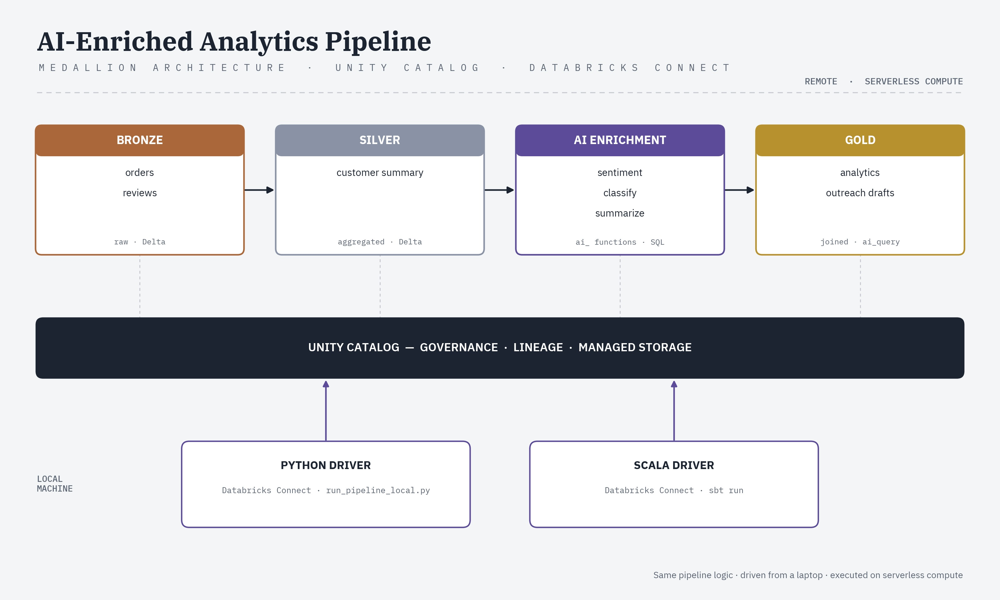
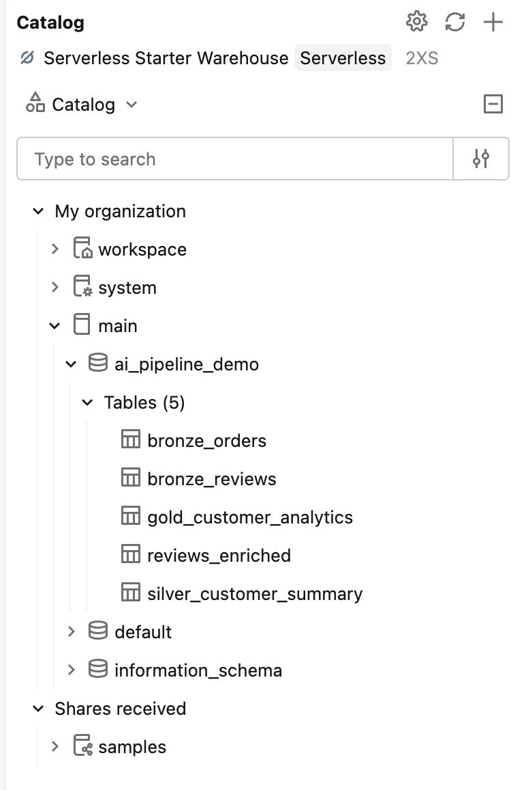
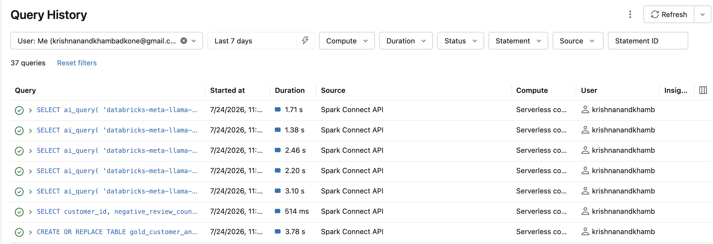

# AI-Enriched Analytics Pipeline on Databricks

A medallion-architecture (bronze → silver → gold) pipeline with a generative AI
enrichment stage in between, built on **Databricks, Unity Catalog, and
Databricks AI Functions**. Implemented twice — once in **Python** and once in
**Scala** — both driven from a local machine via **Databricks Connect**
against serverless compute.



## What it does

1. **Bronze** — generates synthetic orders and product reviews, written as
   Delta tables in Unity Catalog.
2. **Silver** — aggregates orders into a per-customer summary (total orders,
   total spend, average order value, last order date).
3. **AI enrichment** — runs Databricks SQL AI Functions directly on the
   review text, no API keys required:
   - `ai_analyze_sentiment` — sentiment per review
   - `ai_classify` — buckets each review into a category
   - `ai_summarize` — one-line summary per review
4. **Gold** — joins silver with the enriched reviews into a single analytics
   table, including a negative-review count per customer.
5. **Optional outreach drafts** — for customers with 2+ negative reviews,
   `ai_query` drafts a short outreach email against a served model.

Everything runs on **serverless compute** — no cluster to provision or tune.

## Repo structure

```
ai-enriched-databricks-pipeline/
├── README.md
│   architecture_diagram.jpg
│   run_pipeline_local.py       # local driver via Databricks Connect
│   requirements.txt

## Prerequisites

- A Databricks workspace with Unity Catalog enabled (Free Edition, trial, or
  paid — this pipeline runs unchanged on any of them)
- A personal access token: in the workspace, **Settings → Developer → Access
  tokens → Generate new token**
- Your workspace URL, e.g. `https://your-workspace.cloud.databricks.com`

## One-time setup — Databricks CLI (shared by both languages)

```bash

brew tap databricks/tap && brew install databricks
databricks configure --host https://<your-workspace-url>
# paste your personal access token when prompted
```

This writes your host and token to `~/.databrickscfg`, which both the Python
and Scala clients below read from automatically.

> **Never commit `~/.databrickscfg` or your token to this repo.** It lives
> outside the project directory by default, but double-check before pushing.

---

## Running the Python version

```bash
cd python
python3 -m venv .venv
source .venv/bin/activate
pip install -r requirements.txt
python run_pipeline_local.py
```

Your driver code runs locally; every Spark operation and AI Function call
executes on Databricks serverless compute against your Unity Catalog tables.

### Alternative: run entirely inside Databricks

Import `ai_enriched_pipeline.py` into your workspace as a notebook
(**Workspace → Import**), attach it to serverless compute, and Run All. This
rebuilds the same tables without touching your local machine at all.

---

## Configuration

`run_pipeline_local.py` define these at
the top:

```
CATALOG_NAME = "main"          # swap for an existing catalog if this fails
SCHEMA_NAME  = "ai_pipeline_demo"
```

If catalog creation fails on permissions, run `SHOW CATALOGS;` in your
workspace and use one you already have access to.

## Troubleshooting

Issues actually hit while building this, in case they save you time:

| Symptom | Cause | Fix |
|---|---|---|
| `IllegalArgumentException: need cluster id or serverless to construct a session` (Scala) | `DatabricksSession.builder()` wasn't told which compute to target | Add `.serverless()` before `.getOrCreate()` |
| `unclosed string literal` in `build.sbt` | Missing closing `"` on the `javaHome` line | Check every `file("...")` path ends with `"))` |
| Delta schema merge error on `order_date` when switching between the Python and Scala versions against the same tables | Python's `datetime.datetime` infers as `TimestampType`; Scala's `java.sql.Date` infers as `DateType` — Delta won't silently reconcile the two on overwrite | Add `.option("overwriteSchema", "true")` to the `bronze_orders`, `bronze_reviews`, and `silver_customer_summary` writes |
| `java -version` still shows the wrong JDK after `export JAVA_HOME=...` | On macOS/Homebrew, `java` on `PATH` doesn't necessarily follow `JAVA_HOME` | Either prepend the right JDK's `bin` to `PATH`, or better, pin `javaHome` directly in `build.sbt` (see above) |
| AI enrichment step (`reviews_enriched`) appears to hang with no output for several minutes | `ai_analyze_sentiment` / `ai_classify` / `ai_summarize` batch through a model-serving endpoint that may need a cold start; the `println` for that stage only fires after the whole statement returns | Not a bug — check **Query History** in the workspace to confirm it's `RUNNING`, then wait it out (observed ~3–4 minutes on Free Edition) |
| `ai_query` step fails or errors | The model name (`databricks-meta-llama-3-3-70b-instruct`) isn't available in your workspace | Check **Serving** in your workspace sidebar for the exact model name available to you and swap it in |

## Notes

- Since Python's `random` and Scala's `scala.util.Random` are different PRNG
  algorithms, seeding both with `42` does **not** produce identical synthetic
  data across the two languages — only reproducible runs *within* each
  language.
- Nothing here is tied to a specific Databricks tier — Free Edition, trial,
  and paid workspaces all work unchanged.


## Databricks Output



